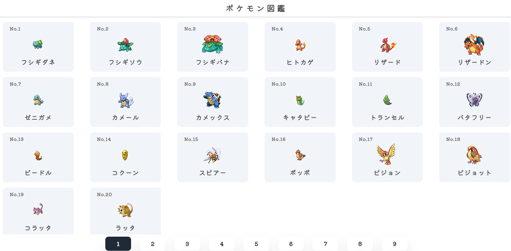

# ポケモン図鑑アプリ with React
PekeAPIを用いたポケモン図鑑アプリです。 
ポケモンの詳細画面から種族や能力値、ゲームソフト別の説明文などを閲覧できます。 
また、メガシンカ、キョダイマックス、リージョンフォーム(ガラルの姿、ヒスイの姿など) 
があるポケモンの場合、右上の数字のボタンから切り替えることができます。 
スマホからも閲覧いただけます。 

## URL
https://pokemon-app-seven-henna.vercel.app/

## 使用技術
- React
- TypeScript
- Swiper
- PokeAPI
- react-indiana-drag-scroll
